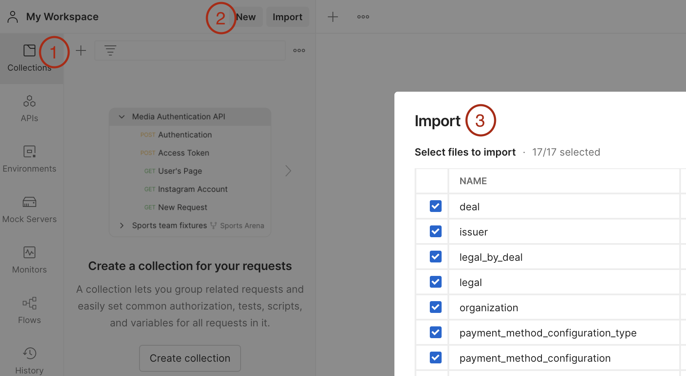
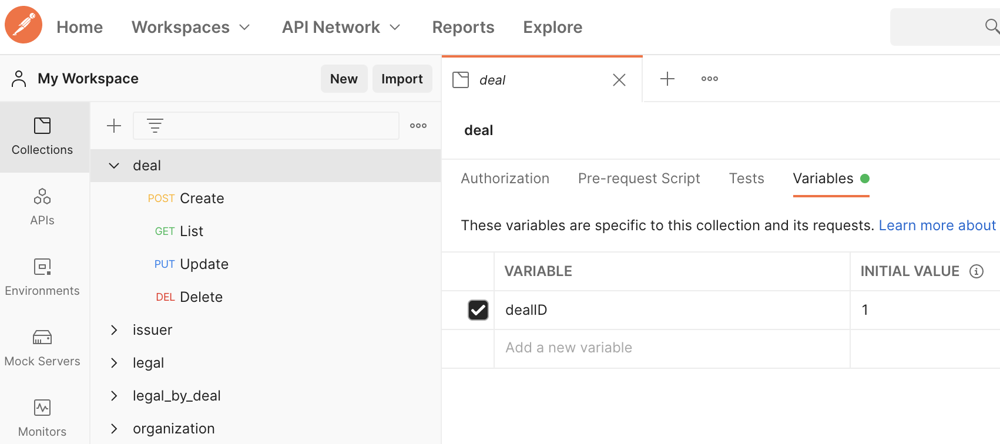
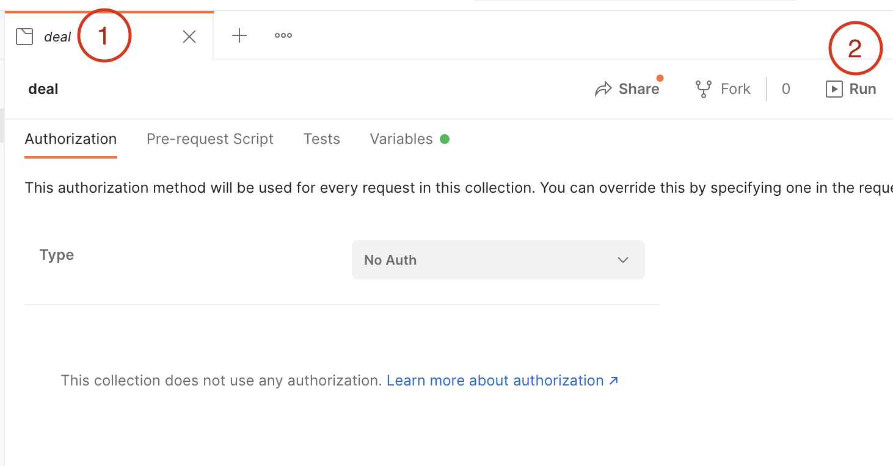

# Postman


## Guide

### Import

<p align="center">
    
</p>

### [Variables]

1. **Environment**
    * Create:
        ```yaml
        Environments -> New -> Environment
        NAME: local
        VARIABLE: server
        TYPE: default
        INITIAL VALUR: localhost:8080
        CURRENT VALUR: localhost:8080
        ```
    <p align="center">
        
    </p>
2. **For each collection**
    <p align="center">
        
    </p>

### [Run Tests]

<p align="center">
    
</p>

[Variables]: https://learning.postman.com/docs/sending-requests/variables/
[Run Tests]: https://www.youtube.com/watch?v=VywxIQ2ZXw4
