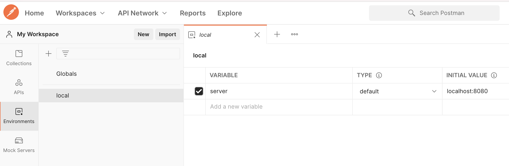
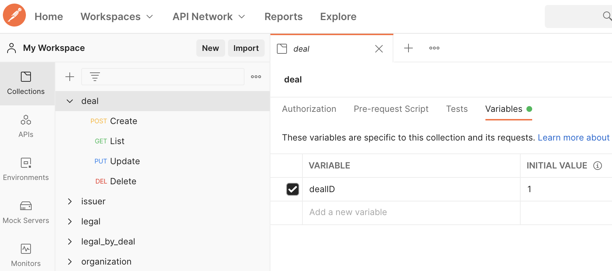

# Postman


## Uso

### [Import]

<p align="center">
    
</p>


### [Variables]

1. **[Environment]**
    * Diligenciar:
        ```yaml
        Environments -> New -> Environment
        NAME: local
        VARIABLE: server
        TYPE: default
        INITIAL VALUR: localhost:8080
        CURRENT VALUR: localhost:8080
        ```
    <p align="center">
        
    </p>
2. **For each collection**
    <p align="center">
        
    </p>


3. **Import...** -> **Gradle (STS)** -> **Gradle (STS) Project** `Se usara la version de gradle que esta dentro del proyecto configurada: gradle/wrapper/gradle-wrapper.properties`
4. Instalar lombok `en caso de que el Ide no lo tenga instalado`
    <details><summary><b>En eclipse</b>  <b>(Click aqui)</b></summary>

    * Ir al proyecto `comercial-backend-comando-aplicacion`
    * En `Gradle Dependencies`
    * Click derecho en el jar: `lombok-1.16.18.jar`
    * **Run As** -> **Java Application**
    * En la ventana de instalacion de lombok, seleccionar el eclipse e instalar
    </details>

5. Configurar arranque:
    * **En eclipse** -> **Run** -> **Run Configurations**
    * Click derecho en **Java Application** -> **New Configuration**
    * Diligenciar:
        ```yaml
        Name: comercial
        Project: comercial-backend
        Main class: com.vegaflor.core.Application
        Arguments -> VM arguments: -Dspring.profiles.active=local
        Apply -> Run
        ```
</details>

### Ejecutar
**Run As...** -> **comercial**

[Variables]: https://learning.postman.com/docs/sending-requests/variables/

## Frontend
| Herramienta | Version |
| ------ | ------ |
| Compilador | **Viene en el navegador** |
| Ide | **Cualquiera** |
| Administrador de Dependencias | **npm >= 6** `Instalar Node.js` |
| Framwork | **[Angular CLI 7.3.3]** `npm install -g @angular/cli@7.3.3` |

### Configuración inicial
<details><summary>Si es la primera vez que <b>configura el proyecto</b>  <b>(Click aqui)</b></summary>

1. Instalar el [token] para importar el comun-frontend
    * En https://github.com/ ir a **Settings** -> **Developer settings** -> **Personal access tokens** -> **Generate new token**
    * Reemplazar **<TOKEN_HERE>** por el token y ejecutar
        ```sh
        git config --global url."https://<TOKEN_HERE>:x-oauth-basic@github.com/".insteadOf https://x-oauth-basic@github.com/
        ```
2. Instalar Dependencias: **Pendiente:** `npm notice created a lockfile as package-lock.json. You should commit this file.`
    ```sh
    npm install
    ```
3. Agregar al archivo **Hosts** el dominio local:
    ```yaml
    127.0.0.1	vegasoft.dev.local
    ```
    * [En MAC]
4. Modificar en el archivo **environment.ts** las propiedades: **Pendiente** `simplificar proceso, ya que el archivo no se puede ignorar`
    ```diff
    APLICACION: 2,
    -  URLCognito: `https://vegasoftdevelop.auth.us-east-1.amazoncognito.com/login?response_type=code&client_id=3uplh7kivsv4965k6apsoo9jk9&redirect_uri=https://qa-vegasoft.grupovegaflor.com`,
    -  URLCognitoLogout: 'https://vegasoftdevelop.auth.us-east-1.amazoncognito.com/logout?client_id=3uplh7kivsv4965k6apsoo9jk9&logout_uri=https://qa-vegasoft.grupovegaflor.com/',
    +  URLCognito: `https://vegasoftdevelop.auth.us-east-1.amazoncognito.com/login?response_type=code&client_id=3uplh7kivsv4965k6apsoo9jk9&redirect_uri=https://vegasoft.dev.local:4200`,
    +  URLCognitoLogout: 'https://vegasoftdevelop.auth.us-east-1.amazoncognito.com/logout?client_id=3uplh7kivsv4965k6apsoo9jk9&logout_uri=https://vegasoft.dev.local:4200/',
    URLCognitoProd: `https://vegasoft.auth.us-east-1.amazoncognito.com/login?response_type=code&client_id=3rorht6dgibjpg1ucr761mq2rb&redirect_uri=https://vegasoft.grupovegaflor.com`,
    URLCognitoLogoutProd: 'https://vegasoft.auth.us-east-1.amazoncognito.com/logout?client_id=3rorht6dgibjpg1ucr761mq2rb&logout_uri=https://vegasoft.grupovegaflor.com/'
    ```
</details>

### Ejecutar
1. Ejecutar aplicacion
    ```sh
    npm start
    ```
2. Ingresar a la aplicacion
    * https://vegasoft.dev.local:4200/comercial/home
    * Login:
        ```yaml
        US: pruebas
        PW: 123456
        ```

[Angular CLI 7.3.3]: https://victorroblesweb.es/2018/11/20/instalar-angular-7-paso-a-paso/
[token]: https://stackoverflow.com/questions/23210437/npm-install-private-github-repositories-by-dependency-in-package-json
[En MAC]: https://www.hostinet.com/formacion/hosting-alojamiento/editar-archivo-hosts-mac-os-x-macos/

## DB local
<details><summary>Si desea utilizar una <b>BD local con docker</b>  <b>(Click aqui)</b></summary>

1. Instalar docker
2. Correr imagen de [SQL Server]
    ```sh
    docker run -e 'ACCEPT_EULA=Y' -e 'SA_PASSWORD=Vegasoft!Passw0rd' -p 1433:1433 --name sql_server -d mcr.microsoft.com/mssql/server:2017-CU8-ubuntu
    ```
    <details><summary><b>Pequeño manual de docker</b>  <b>(Click aqui)</b></summary>

    * Instanciar una **imagen** en un nuevo **contenedor**
        ```sh
        docker run --name sql_server ...
        ```
    * Detener **contenedor**
        ```sh
        docker stop sql_server
        ```
    * Consultar el estado del **contenedor**
        ```sh
        docker ps -a
        ```
    * Reanudar **contenedor**
        ```sh
        docker start sql_server
        ```
    * Borrar **contenedor** `Previamente se debe detener`
        ```sh
        docker rm sql_server
        ```
    * Ver log del **contenedor**
        ```sh
        docker logs sql_server
        ```
    </details>

3. Cambiar la **contraseña** del usuario **sa**
    * Conectarse al sqlcmd del **contenedor**
        ```sh
        docker exec -it sql_server /opt/mssql-tools/bin/sqlcmd -S localhost -U sa -P 'Vegasoft!Passw0rd'
        ```
    * Ejecutar los siguientes **comandos** en el mismo orden
        ```sh
        ALTER LOGIN sa ENABLE;
        GO
        ALTER LOGIN sa WITH PASSWORD = '1035911044', CHECK_EXPIRATION=OFF, CHECK_POLICY=OFF;
        GO
        exit
        ```
4. Copiar el **BackUp de la BD** en el contenedor de Docker
    * Validar quel **contenedor** este corriendo
        ```sh
        docker ps -a
        ```
    * Crear directorio en el **contenedor**
        ```sh
        docker exec -it sql_server mkdir /var/opt/mssql/backup
        ```
    * Reemplazar **<ROUTE_BACKUP>** por la ruta del **BackUp de la BD** y ejecutar
        ```sh
        docker cp <ROUTE_BACKUP>.bak sql_server:/var/opt/mssql/backup
        ```
5. Instalar cliente
    * En MAC es recomendado el [Azure Data Studio]
        * Instar el [cliente Azure Data Studio]
        * Habilitar el Azure Data Studio para [Restaurar BD]
        * Restaurar la BD a partir del [BackUp]
6. Datos BD
    ```yaml
    BD: VegaSoftDB
    US: sa
    PW: 1035911044
    PT: 1433
    ```
7. Validar en el archivo **application-local.yml** que las propiedades concuerden:
    ```yaml
    jdbcUrl: jdbc:sqlserver://localhost;databaseName=VegaSoftDB
    username: sa
    password: 1035911044

    spring.flyway.url: jdbc:sqlserver://localhost;databaseName=VegaSoftDB
    spring.flyway.user: sa
    spring.flyway.password: 1035911044
    ```
</details>

[SQL Server]: https://hub.docker.com/_/microsoft-mssql-server
[Azure Data Studio]: https://docs.microsoft.com/en-us/sql/azure-data-studio/quickstart-sql-server?view=sql-server-ver15
[cliente Azure Data Studio]: https://www.quackit.com/sql_server/mac/install_azure_data_studio_on_a_mac.cfm
[Restaurar BD]: https://techcommunity.microsoft.com/t5/sql-server-engine/sql-operation-studio-enable-preview-features-azure-data-studio/m-p/1090921
[BackUp]: https://www.quackit.com/sql_server/mac/how_to_restore_a_bak_file_using_azure_data_studio.cfm

## Subir ambiente local para desarrollar
<details><summary>Subir el contenedor de <b>SQL Server</b>  <b>(Click aqui)</b></summary>

* Validar estado del **contenedor**
    ```sh
    docker ps -a
    ```
* Reanudar **contenedor** `en caso de estar detenido`
    ```sh
    docker start sql_server
    ```
</details>

<details><summary>Subir el jar de <b>seguridad</b>  <b>(Click aqui)</b></summary>

* En una **consola** ubicarse en la ruta del proyecto **seguridad/seguridad**
* **Compilar** con el **gradlew** `En caso de error de permisos ejecutar "chmod +x gradlew"`
    ```sh
    ./gradlew build -x test
    ```
* Ejecutar **jar**
    ```sh
    java -Dspring.profiles.active=local -jar build/libs/seguridad-0.0.1-SNAPSHOT.jar
    ```
</details>

<details><summary>Subir el jar de <b>produccion</b>  <b>(Click aqui)</b></summary>

* En una **consola** ubicarse en la ruta del proyecto **produccion/produccion-backend**
* **Compilar** con la version de **gradle 4.6**
    ```sh
    gradle build -x test
    ```
* Ejecutar **jar**
    ```sh
    java -Dspring.profiles.active=local -jar build/libs/produccion-backend-0.0.1-SNAPSHOT.jar
    ```
</details>

## Ejecutar pruebas
<details><summary>Pruebas unitarias y funcionales <b>Backend</b>  <b>(Click aqui)</b></summary>

* Cambiar en los **2** archivos **application.yml** las propiedades: **Pendiente** `simplificar proceso, ya que el archivo no se puede ignorar`
    ```diff
    datasource:
        driver-class-name: com.microsoft.sqlserver.jdbc.SQLServerDriver
        type: com.zaxxer.hikari.HikariDataSource 
    -      jdbcUrl: jdbc:sqlserver://db.qa;databaseName=VegaSoftDB_Test
    -      username: ENC(kZSO1rhscG3+iT1QuiG/2FCXr3VnWLx9)
    -      password: ENC(2Y3MWX2OltEVy5+4gR+V7AaDBROJpEyw)
    +      jdbcUrl: jdbc:sqlserver://localhost;databaseName=VegaSoftDB
    +      username: sa
    +      password: 1035911044
        hikari:
            poolName: pool
    ```
* En una **consola** ubicarse en la ruta del proyecto **comercial/comercial-backend**
* **Ejecutar test** con la version de **gradle 4.6**
    ```sh
    gradle --stacktrace test
    ```
</details>

<details><summary>Pruebas unitarias <b>Frontend</b>  <b>(Click aqui)</b></summary>

* En una **consola** ubicarse en la ruta del proyecto **comercial/comercial-frontend**
* **Ejecutar test**
    ```sh
    ng test --watch=false --browsers ChromeHeadless --code-coverage
    ```
</details>

## Ejecutar jar
<details><summary>Para pruebas manuales <b>sin necesidad de instalar eclipse</b>  <b>(Click aqui)</b></summary>

* En una **consola** ubicarse en la ruta del proyecto **comercial/comercial-backend**
* **Compilar** con la version de **gradle 4.6**
    ```sh
    gradle clean build -x test
    ```
* Ejecutar **jar**
    ```sh
    java -Dspring.profiles.active=local -jar build/libs/comercial-0.0.1-SNAPSHOT.jar
    ```
</details>
